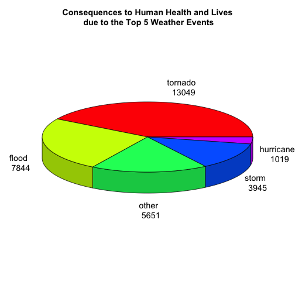
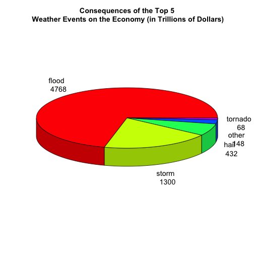
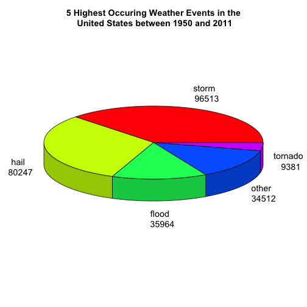

Reproducible Research Project 2: Severe Weather Events Analysis in the United States
===================================================================
All the documents and code used in this project can be found at
[this] (https://github.com/muntasir2165/RepData_PeerAssessment2) Github repository. If the link does not work, please copy and paste the following url into your browser:
https://github.com/muntasir2165/RepData_PeerAssessment2

# Synopsis 
In this analysis project, we explored the aftemath of severe weather events in the US over the past 60 years (1950-2011). We particularly consider the events that have caused the most harmful effects on human health (in terms of injury and fatatlity) and the greatest economic impact (interms of property and crop damage). After acquiring the data of about one million records, we pre-processed it by considering 28 well-defined major weather events and classifying the data accordingly. Any event that our search and match algorithm failed to identify was labelled as "other". Next, we counted the occurence of each event, the total injuries and fatalities it caused, and the resultant total property and crop damage. We summed up the injuries and fatalities for a quantitative estimate of the effect on human lives and also determined the total economic cost of the event my adding up the proerty and crop damage costs. Our analysis revealed that tornado was the most the devastating event accounting for about 13,049 injuries and human lives. As for economy, flood had the most effect amounting to about 4,768 Trillion Dollars. In addition, we also determined that the event with the highest frequency in the United States was storm with over 96,000 counts.

# Data Processing 
Please note that, unless stated otherwise, all R codes in the Data Processing section of this report are not actually evaluated when generating the Rmd file to save time from the lengthy processing that is required

Read in the database file into R

```r
fileName <- "repdata-data-StormData.csv.bz2"
data <- read.csv(fileName)
```

Create a new dataframe with the columns EVTYPE, FATALITIES, INJURIES, PROPDMG, PROPDMGEXP, CROPDMGEXP and CROPDMG from data

```r
data1 <- data.frame(data$EVTYPE, data$FATALITIES, data$INJURIES,
                    data$PROPDMG, data$PROPDMGEXP, data$CROPDMG, data$CROPDMGEXP)
```

Re-name the columns in the data1 data frame

```r
names(data1) <- tolower(c("EVTYPE", "FATALITIES", "INJURIES", "PROPDMG","PROPDMGEXP", "CROPDMG", "CROPDMGEXP"))
```

Turn the elements in the evtype, propdmgexp and cropdmgexp columns
from factor into character

```r
data1[,1] <- as.character(data1$evtype)
data1[,5] <- as.character(data1$propdmgexp)
data1[,7] <- as.character(data1$cropdmgexp)
```

Please note that we will ignore the multipliers for property
damage (PROPDMGEXP) and cropdamage (CROPDMGEXP) unless they are one of h/H (hundred), k/K (thousand), m/M (million) or b/B (billion).

There are two reasons for doing so. 
1. We could not determime the meaning of the other values (such
as, "0", "1", "2" etc.) in the PROPDMGEXP and CROPDMGEXP columns.
2. Including multipliers other than h, k, m or b in our analysis
drastically increases our processing time which we are
unable to afford with our computer's limited processing power and
the project deadline.

Therefore, please be advised that our analysis and result
interpretation that follows may not be precise or entirely correct

28 weather types considered (please not that the following weather
condition listing is not exhaustive). Other unrecognized weather
conditions are considered under "other"


```r
weather <- c("rain", "storm", "sun", "cloud", "hot", "cold",
             "dry", "wet", "windy", "hurricane", "typhoon", 
             "sand storms", "snow storms", "tornado", "humid",
             "fog", "snow", "thundersnow", "hail", "sleet", 
             "drought", "wildfire", "blizzard", "avalanche",
             "mist", "freez", "dust", "flood", "other")
```

Create a new data frame - dataSummary - to record the aggregate
results of weather incident counts, fatalities, injuries, property damage, crop damage and total damage for each of the above weather conditions.

```r
incidentTotal <- vector(mode="numeric", length=length(weather))
fatalitiesTotal <-vector(mode="numeric", length=length(weather))
injuriesTotal <-vector(mode="numeric", length=length(weather))
propDmgTotal <-vector(mode="numeric", length=length(weather))
cropDmgTotal <-vector(mode="numeric", length=length(weather))
damageTotal <-vector(mode="numeric", length=length(weather))
dataSummary <- data.frame(weather, incidentTotal, 
                          fatalitiesTotal, injuriesTotal,
                          propDmgTotal, cropDmgTotal, damageTotal)
```

Function to determine the multiplier's numerical value from the
propdmgexp and cropdmgexp columns in the data1 dataframe

```r
multiplier <- function(letter) {
        #Return the multiplier letter's numerical value
        #If the multiplier is not one of h/H, k/K, m/M, and b/B,
        #the function returns 1
        multiplier <- 1
        
        if (grepl('h', tolower(letter))) multiplier <- 100
        else if (grepl('k', tolower(letter))) multiplier <- 1000
        else if (grepl('m', tolower(letter))) multiplier <- 1000000
        else if (grepl('b', tolower(letter))) multiplier <- 1000000000
        
        multiplier
} 
```

Populate the dataSummary data frame with the aggregate results
for each of the categories - fatalities, injuries, property
damage, crop damage and total damage - for each of the 28 weather
conditions.

The major simplifying assumption in our analysis is to ignore
the rows in data1 where:
* propdmgexp is not one of h/H, k/K, m/M, and b/B
* cropdmgexp is not one of h/H, k/K, m/M, and b/B

```r
for (row in seq(data1$evtype)) {
        instance <- tolower(data1$evtype[row])
        propMultiplier <- multiplier(data1$propdmgexp[row])
        cropMultiplier <- multiplier(data1$cropdmgexp[row])
        #print(row)
        if (propMultiplier== 1 || cropMultiplier==1) {
                next
        }
        iteration <- 0
        for (index in seq(dataSummary$weather)) {
                condition <- dataSummary$weather[index]
                iteration <- iteration + 1
                found = grepl(condition, instance)
                if (found) {
                        data1$evtype[row] = condition
                        dataSummary$incidentTotal[index] = dataSummary$incidentTotal[index] + 1 
                        dataSummary$fatalitiesTotal[index] = dataSummary$fatalitiesTotal[index] + data1$fatalities[row]
                        dataSummary$injuriesTotal[index] = dataSummary$injuriesTotal[index] + data1$injuries[row]
                        dataSummary$propDmgTotal[index] = dataSummary$propDmgTotal[index] + (data1$propdmg[row] * propMultiplier)
                        dataSummary$cropDmgTotal[index] = dataSummary$cropDmgTotal[index] + (data1$cropdmg[row] * cropMultiplier)
                        dataSummary$damageTotal[index] = dataSummary$damageTotal[index] + (dataSummary$propDmgTotal[index] + dataSummary$cropDmgTotal[index])
                        #print(condition)
                        break
                }
                else if (!found & iteration==29) {
                        data1$evtype[row] = condition
                        dataSummary$incidentTotal[index] = dataSummary$incidentTotal[index] + 1 
                        dataSummary$fatalitiesTotal[index] = dataSummary$fatalitiesTotal[index] + data1$fatalities[row]
                        dataSummary$injuriesTotal[index] = dataSummary$injuriesTotal[index] + data1$injuries[row]
                        dataSummary$propDmgTotal[index] = dataSummary$propDmgTotal[index] + (data1$propdmg[row] * propMultiplier)
                        dataSummary$cropDmgTotal[index] = dataSummary$cropDmgTotal[index] + (data1$cropdmg[row] * cropMultiplier)
                        dataSummary$damageTotal[index] = dataSummary$damageTotal[index] + (dataSummary$propDmgTotal[index] + dataSummary$cropDmgTotal[index])
                        #print(condition)
                }
        }
}
```
Please be advised that the above chunk of code requires a large amount of time to execute and produce an output. Therefore, it was
not evaluated when generating the Rmd document.

Save the dataSummary containing the aggregate data in a .csv file
in case we need the processed data again and if we do not want to
wait for the time consuming processing to repeat itself. This will
especially come in handy when generating the Rmd document.

```r
write.csv(file='cleanData.csv', x=dataSummary)
```

Starting at this point, the following R code chunks are evaluated
in knitr when knitting the document

Read in the cleaned up data from the cleanData.csv file into R

```r
newData <- read.csv("cleanData.csv")
```

The columns and data in the newData dataframe

```r
names(newData)
```

```
## [1] "X"               "weather"         "incidentTotal"   "fatalitiesTotal"
## [5] "injuriesTotal"   "propDmgTotal"    "cropDmgTotal"    "damageTotal"
```

```r
head(newData)
```

```
##   X weather incidentTotal fatalitiesTotal injuriesTotal propDmgTotal
## 1 1    rain          5269              16            47    3.474e+08
## 2 2   storm         96513             238          3707    1.137e+10
## 3 3     sun            19              33           129    1.441e+08
## 4 4   cloud          2382               0             0    6.510e+04
## 5 5     hot             0               0             0    0.000e+00
## 6 6    cold          1333             155            23    1.219e+08
##   cropDmgTotal damageTotal
## 1    1.269e+08   2.187e+12
## 2    6.170e+09   1.300e+15
## 3    2.000e+04   1.727e+09
## 4    0.000e+00   6.023e+07
## 5    0.000e+00   0.000e+00
## 6    9.855e+06   1.643e+11
```

Create a new data frame newData1 with an additional column that
contains the total human injuries and fatalities due to each
event

```r
injuriesFatalitiesTotal <- newData$injuriesTotal + newData$fatalitiesTotal

newData1 <- cbind(newData[,2:3], newData$injuriesTotal,
                  newData$fatalitiesTotal, injuriesFatalitiesTotal,
                  newData[,6:8])
```

Re-name the columns in newData1

```r
names(newData1) <- c("weather", "incidentCount", "injuries",
                     "fatalities", "injuryFatalityTotal",
                     "propertyDamage", "cropDamage", "damageTotal")
```

The columns and data in the newData1 dataframe

```r
names(newData1)
```

```
## [1] "weather"             "incidentCount"       "injuries"           
## [4] "fatalities"          "injuryFatalityTotal" "propertyDamage"     
## [7] "cropDamage"          "damageTotal"
```

```r
head(newData1)
```

```
##   weather incidentCount injuries fatalities injuryFatalityTotal
## 1    rain          5269       47         16                  63
## 2   storm         96513     3707        238                3945
## 3     sun            19      129         33                 162
## 4   cloud          2382        0          0                   0
## 5     hot             0        0          0                   0
## 6    cold          1333       23        155                 178
##   propertyDamage cropDamage damageTotal
## 1      3.474e+08  1.269e+08   2.187e+12
## 2      1.137e+10  6.170e+09   1.300e+15
## 3      1.441e+08  2.000e+04   1.727e+09
## 4      6.510e+04  0.000e+00   6.023e+07
## 5      0.000e+00  0.000e+00   0.000e+00
## 6      1.219e+08  9.855e+06   1.643e+11
```

# Results
### Across the United States, which types of events (as indicated in the EVTYPE variable) are most harmful with respect to population health?

In determining events that are the most harmful with respect to human
health, we would consider the injury and fatality data.  

Pie chart of the top 5 events corresponding to the effect on
injuries and fatalities combined  

Initialize the margin and plotting parameters

```r
par(mar=c(2,2,3,1))
par(mfrow=c(1,1))
```

Install the 3D pie chart package "plotrix" (if necessary) and then load it

```r
#install.packages("plotrix")
library(plotrix)
```

Plot the 3D pie chart of the top 5 events that caused the most damage to
humans and their health (in terms of injuries and fatalties) in the past

```r
X <- newData1[order(newData1$injuryFatalityTotal, decreasing=TRUE),][1:5,]
labels <- paste(X$weather, "\n", X$injuryFatalityTotal)
pie3D(X$injuryFatalityTotal, labels = labels, main="Consequences to Human Health and Lives\n due to the Top 5 Weather Events", labelcex=1.2)
```

 

**Based on the numbers above, the most devastating/harmful events for human health are tornadoes, followed by floods, others, storms, and lastly, hurricanes.**  
Please note that "other" includes a variety of weather events that were not categorized into specific events due to the data analyst's lack of skills in doing so.

### Across the United States, which types of events have the greatest economic consequences?

In determining the events with the greatest economic consequences, we
would consider the property and crop damage data.  

Pie chart of the top 5 events with the greatest economic
consequences

Plot the 3D pie chart of the top 5 events that had the most effect on
the economy in the past

```r
Y <- newData1[order(newData1$damageTotal, decreasing=TRUE),][1:5,]
damageInTrillions <- round(Y$damageTotal/1e+12)
labels <- paste(Y$weather, "\n", damageInTrillions)
pie3D(damageInTrillions, labels = labels, main="Consequences of the Top 5\n Weather Events on the Economy (in Trillions of Dollars)", labelcex=1.2)
```

 

**Based on the numbers above, the most costly/economically consequential events are floods, followed by storms, hails, others, and lastly, tornadoes.**   
Please note that "other" includes a variety of weather events that were not categorized into specific events due to the data analyst's lack of skills in doing so.

### (Additional analysis) Across the United States, which types of events occured the most?

Pie chart of the top 5 events with the highest frequency

Plot the 3D pie chart of the top 5 events that occured the most in the 
past

```r
Z <- newData1[order(newData1$incidentCount, decreasing=TRUE),][1:5,]
labels <- paste(Z$weather, "\n", Z$incidentCount)
pie3D(Z$incidentCount, labels = labels, main="5 Highest Occuring Weather Events in the\n United States between 1950 and 2011", labelcex=1.2)
```

 

**Based on the numbers above, the events that happened the most in the past are storms, followed by hails, floods, others, and lastly, tornadoes.**   
Please note that "other" includes a variety of weather events that were not categorized into specific events due to the data analyst's lack of skills in doing so.
